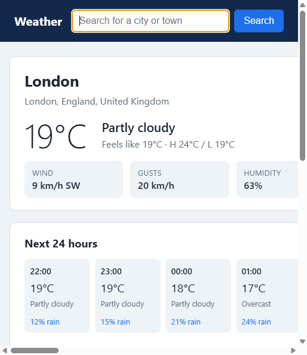
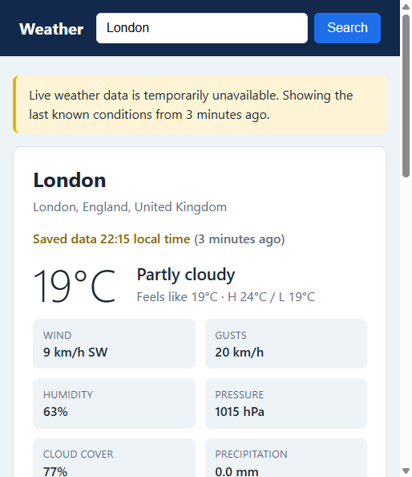

# Weather App

A small weather web application written in Go. Search for a place by name, pick
the right match, and see current conditions, practical highlights, the next 24
hours and a 7-day forecast. If the weather service goes down, the app keeps
showing the last known data for places you've looked at, and tells you how old
it is.

| Live data | Weather service unavailable |
|---|---|
|  |  |

The design write-up (assumptions, trade-offs, what I'd change) is in
[docs/WRITEUP.md](docs/WRITEUP.md).

## Quick start

**Prerequisites:** Go 1.22 or newer. There are no third-party Go dependencies
and no API key is needed. Weather data comes from the free
[Open-Meteo](https://open-meteo.com/) API, so you need internet access unless
you use the offline mock provider.

```sh
# Run against the live Open-Meteo API
go run ./cmd/weatherapp
# then open http://localhost:8080

# Run fully offline with synthetic data
# (knows London, Paris, Springfield, Tokyo, and a few other places)
go run ./cmd/weatherapp -provider mock

# Build a binary
go build -o bin/weatherapp ./cmd/weatherapp

# Tests
go test ./...
go test -race ./...   # needs cgo; runs in CI on Linux
```

If port 8080 is taken, use `-addr localhost:9000`.

Docker (the Dockerfile was not tested locally because Docker isn't installed on
the machine it was written on; CI doesn't build the image yet either):

```sh
docker build -t weatherapp .
docker run -p 8080:8080 -v weather-data:/data weatherapp
```

### Deploying to Vercel

`vercel.json` selects Vercel's Go framework preset and builds `./cmd/weatherapp`.
The app listens on the `PORT` that Vercel provides, and when the `VERCEL`
environment variable is set it stores data in the temp directory, which is the
only writable location. Import the repo in Vercel and deploy; no extra settings
are needed.

On Vercel the cache and recent searches only live as long as a function
instance, so the "survives restarts" part of the outage fallback doesn't apply.
Recent searches are also shared by all visitors there (see Known limitations).

## Configuration

Every flag can also be set with an environment variable. When both are set, the
flag wins.

| Flag | Env var | Default | Purpose |
|---|---|---|---|
| `-addr` | `WEATHER_ADDR` | `localhost:8080`, or `:$PORT` if `PORT` is set | Listen address |
| `-provider` | `WEATHER_PROVIDER` | `openmeteo` | `openmeteo` or `mock` |
| `-data-dir` | `WEATHER_DATA_DIR` | `data` (temp dir on Vercel) | Where the cache and recent searches are stored |
| `-fresh-for` | `WEATHER_FRESH_FOR` | `10m` | How long cached weather is served without refreshing |
| `-max-stale` | `WEATHER_MAX_STALE` | `24h` | Oldest cached weather shown when the API is down |
| `-upstream-timeout` | `WEATHER_UPSTREAM_TIMEOUT` | `5s` | Timeout for each call to the weather API |
| `-geocoding-url`, `-forecast-url` | `WEATHER_GEOCODING_URL`, `WEATHER_FORECAST_URL` | Open-Meteo | Override the API endpoints (self-hosting, or simulating outages) |
| `-log-level` | `WEATHER_LOG_LEVEL` | `info` | `debug`, `info`, `warn` or `error` |

### Trying the outage behaviour

1. Run the app normally and look up a couple of places.
2. Stop it and restart it pointing at an address where nothing is listening:
   ```sh
   go run ./cmd/weatherapp -fresh-for 0s \
     -forecast-url http://127.0.0.1:9/v1/forecast \
     -geocoding-url http://127.0.0.1:9/v1/search
   ```
3. Places you looked up still load, with a banner saying how old the data is.
   Searching still finds them, because the app falls back to matching your
   recent searches. Places you haven't looked up get a clear "temporarily
   unavailable" page (HTTP 503).

## Features

- **Location search** by place name, with a disambiguation list when several
  places match (there are dozens of Londons and Springfields). A single match
  goes straight to its weather page.
- **Current conditions:** temperature, feels-like, description, wind speed and
  direction, gusts, humidity, pressure, cloud cover, precipitation, UV index,
  and sunrise/sunset.
- **Highlights:** plain-language advice, e.g. "Rain likely around 15:00 (70%
  chance), take an umbrella", high UV, strong gusts, or a large feels-like
  difference.
- **Next 24 hours** and a **7-day forecast.**
- **Recent searches** (last 8), saved to disk.
- **Resilience:** persisted last-known-good cache with explicit freshness
  (live, cached or stale). Stale data is shown with a warning. Search falls back
  to recent searches.
- **JSON API** for the same data, which a future SPA or mobile client could use.

### JSON API

```
GET /api/search?q=London
GET /api/weather?lat=51.5085&lon=-0.1257&name=London
GET /api/recent
GET /healthz
```

Errors use a consistent shape and status code: `400` for invalid input, `503`
(with `Retry-After`) when the upstream is unavailable and nothing usable is
cached, and `500` for internal errors.

```json
{ "error": { "code": "invalid_input", "message": "search must be at least 2 characters" } }
```

## Project structure

```
cmd/weatherapp/        entry point: config, wiring, graceful shutdown
internal/weather/      domain model, validation, WMO codes, highlights, provider interfaces
internal/openmeteo/    Open-Meteo client (implements weather.Provider) + recorded fixtures
internal/mock/         deterministic offline provider
internal/store/        file-backed report cache and recent searches (atomic JSON writes)
internal/service/      business rules: caching policy, stale fallback, search fallback, validation
internal/web/          HTTP handlers, HTML templates, JSON API, middleware, embedded assets
docs/                  design write-up and screenshots
```

Dependencies point inward: `web` depends on `service`, `service` depends on
`weather` (and interfaces for cache and history), and `openmeteo`, `mock` and
`store` implement those interfaces. `main` is the only place where the pieces
are connected.

## Assumptions (summary)

The full list, and the questions I'd have asked, are in the write-up.

- This is a single-user, locally run app. Recent searches are global to the
  server, not per user.
- Units are metric (°C, km/h, mm, hPa). All times are shown in the location's
  local time.
- "Remain useful when the service is unavailable" means showing the last known
  data, clearly labelled with its age, for up to 24 hours. Older data is refused
  rather than presented as "current".
- Search works on place names only (no postcodes, addresses or "use my
  location").

## Known limitations

- Recent searches and the cache are shared by everyone using the server, and
  the JSON-file store assumes a single process.
- Metric units only. English only.
- During an outage where the upstream hangs rather than refusing connections,
  every request waits for the upstream timeout (5s) before falling back. A
  circuit breaker would fix this (see the write-up).
- Concurrent requests for the same uncached location each call the upstream
  (no request coalescing).
- The weather page for a place you've never viewed can't work offline. That's
  inherent, but it could be improved by pre-warming the cache.
- Forecast accuracy is whatever Open-Meteo's models provide. The highlights use
  deliberately simple rules.
