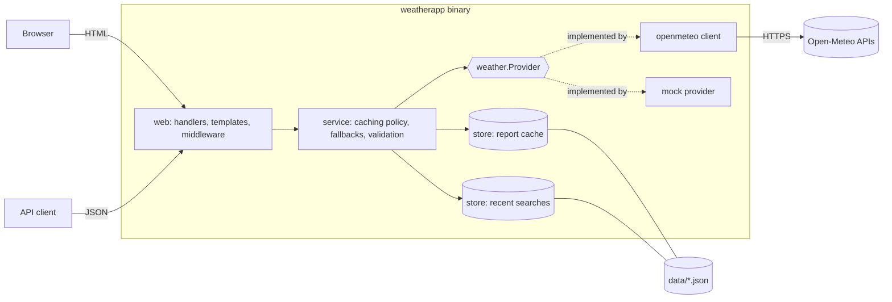
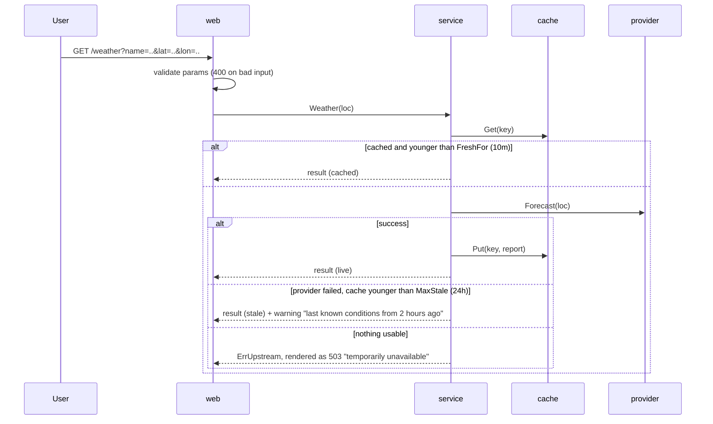

# Design write-up

## TL;DR

A single Go binary, built only on the standard library, that serves server-rendered
HTML plus a JSON API, backed by the free Open-Meteo API. I spent most of the effort
on the part of the brief I thought mattered most: *current conditions should
remain useful when the external service is unavailable*. The app keeps a
persisted last-known-good report per location, labels every result as `live`,
`cached` or `stale`, and tells the user plainly how old the data is. I kept the
UI simple, but every layer is present and tested.

## Architecture

- **`weather`** is the domain layer: types, validation, WMO code descriptions,
  highlights, and the `Geocoder`/`Forecaster` interfaces. It has no I/O.
- **`service`** holds every business rule: freshness, stale fallback, search
  fallback and input normalisation. It depends only on interfaces, so it's tested
  with a fake provider and a manually advanced clock.
- **`openmeteo`** is the only code that knows Open-Meteo's wire format (parallel
  arrays, local times without offsets, `{"error":true,"reason":...}`). Swapping
  providers means writing another implementation of `weather.Provider`.
- **`web`** is thin. Handlers parse and validate input, call the service, and map
  errors to status codes and user-safe messages. HTML and JSON share the same
  service calls.

### How a weather request is handled

## Ambiguities, and the questions I'd have asked

| Question | Assumption I made |
|---|---|
| Who are the users? Is this a public multi-user site or a personal tool? | Single-user, run locally. This drove choices like storing recent searches on the server. |
| What platform: web, CLI, mobile? | Web UI plus a JSON API. It's the most reviewable option, and the API shows the layering. |
| How should locations be searched? Names, postcodes, coordinates, "use my location"? | Place names via a geocoding API, with a disambiguation list. A single match skips the list. |
| What does "remain useful when unavailable" mean? How old is too old? | Show the last known data for up to 24h, clearly labelled with its age. Refuse anything older, because 3-day-old "current conditions" are misleading. |
| Should search also work during an outage? | Yes, as far as possible: fall back to matching recent searches. |
| Should recent searches be remembered? How many? Per user? | Yes: the last 8, de-duplicated, persisted to disk, global to the server (see "change if starting again"). |
| Units and locale? | Metric, English, and times in the location's local timezone (not the viewer's). |
| What extra information is most useful? | Things that change decisions: rain probability timing (umbrella), feels-like, wind and gusts, UV, sunrise/sunset, 24h and 7-day outlooks. |
| How should failures be presented? | Never a blank page or a stack trace. Show a banner explaining what happened, keep the search box and recent searches visible so the user has a way forward, and use proper HTTP statuses. |
| Expected traffic / hosting / budget? | Low traffic, single instance. Open-Meteo's free tier is fine (the 10-minute cache also protects it). |
| Accessibility requirements? | Semantic HTML, labelled controls, `role=status`/`alert` on banners, and no JavaScript needed. No formal audit. |

## Technical decisions and trade-offs

**Go with only the standard library.** Go's `net/http` (with 1.22 method and
path routing), `html/template` (context-aware auto-escaping), `embed` and
`log/slog` cover everything this app needs. With no dependencies, a reviewer can
clone and `go run` it with nothing else installed, and the result is a single
static binary. The trade-off: I hand-wrote small things a framework would give
me, such as middleware chaining and flag/env config.

**Server-rendered HTML instead of a SPA.** The brief says "we'd rather see a bit
of each layer than a complete UI and nothing else". Server rendering let me spend
the time on the service and resilience logic, it works without JavaScript, and
it's easy to test with `httptest`. The JSON API exists so that a richer client
(autocomplete, charts) can be added without touching the service layer.

**Open-Meteo.** Free, no API key, so reviewers can run the app immediately. It
has both geocoding and forecast endpoints, and good documentation. I recorded
real responses as test fixtures so the client tests exercise the real wire
format.

**Locations travel in the URL (`name`, `lat`, `lon`, …) rather than as an ID.**
Pages are bookmarkable and shareable. More importantly, the weather page doesn't
need a geocoding lookup to turn an ID back into coordinates, so it keeps working
from cache while geocoding is down. The trade-off is less tidy URLs, and the name
is user-controllable. It's only ever displayed (escaped by `html/template`) and
the coordinates are validated.

**Caching policy lives in the service; the cache only stores.** `store` has no
notion of expiry. `service` decides what counts as "fresh" (10 minutes; forecast
models update hourly at best) and what counts as "too stale to show" (24 hours).
This keeps the rules in one tested place, and lets the same entry be "fresh" for
normal requests and "usable" as a fallback.

**Cache key = coordinates rounded to 2 decimal places (~1km).** That's finer
than forecast model resolution, and it merges near-identical searches. Because
two differently named places can share a key, the service re-applies the
requested location to the result.

**Persistence: JSON files with atomic writes.** Zero setup and human-readable,
and the cache survives restarts, which the outage behaviour depends on. Writes go
to a temp file followed by a rename, so a crash can't leave a half-written file.
A corrupt file is moved aside instead of blocking startup. This wouldn't hold up
under multiple processes or large data; SQLite or Redis would be the next step.

**Errors.** Two sentinel errors, `ErrInvalidInput` and `ErrUpstream`, are wrapped
with `%w` throughout. The web layer maps them in one function (`errorInfo`) to
status code, machine-readable code and a user-safe message. Internal details
(e.g. "dial tcp: connection refused") are logged, never shown. Templates render
into a buffer first, so a template error produces a clean 500 rather than a
half-written 200.

**Operational basics.** Server read/write/idle timeouts, an HTTP client timeout,
capped response body size, graceful shutdown on SIGINT/SIGTERM, panic recovery,
structured request logs, and security headers (CSP, `nosniff`, `no-referrer`).

## Testing

`go test ./...` runs 51 test functions (69 including subtests). Statement
coverage is 85–95% for every internal package; `cmd` is lower because `run()` is
wiring I verified manually. CI also runs the tests with `-race`.

What I tested, and why:

- **`service`** got the most tests because that's where the logic is. I cover
  every branch of the caching policy (live, cached, refresh after the fresh
  window, stale fallback, refusal past max-stale, no cache), trimming of elapsed
  forecast hours, recent-search recording (including *not* recording failures),
  the search fallback, and query validation. They use a fake provider and a
  manual clock, so they're deterministic and fast.
- **`openmeteo`** is tested against recorded real responses served by
  `httptest`, plus the failure modes: API error bodies, 5xx with no body,
  non-JSON responses, mismatched array lengths and timeouts. All of them must
  surface as `ErrUpstream`.
- **`store`**: persistence round-trips, eviction, ordering and de-duplication,
  recovery from a corrupt file, and that `List()` returns a copy.
- **`web`**: status codes and content for each page, redirects, the stale
  banner, a 503 that doesn't leak internals, XSS escaping of user input, JSON
  error shapes, 404s, panic recovery, and URL round-tripping of locations
  (including non-ASCII names).
- **`cmd`**: config precedence (flag over env over default) and validation.

What I intentionally didn't test:

- **Live calls to Open-Meteo in the test suite.** They'd be slow and flaky, and
  they'd fail in CI without network access. The recorded fixtures cover the wire
  format. A separate, opt-in contract test (e.g. behind a build tag) would be the
  right way to detect API drift.
- **Pixel-level UI and browser tests.** The templates are covered by handler
  tests asserting on content. I checked layout manually in a browser at a narrow
  (mobile) width, which is how I found and fixed a horizontal overflow bug.
- **`main.run` end to end.** It's wiring. I verified it manually, including the
  outage scenario: warm the cache, restart with dead upstream URLs, and confirm
  the stale banner and the search fallback.
- **Load and concurrency tests.** Out of scope for the expected traffic. The
  stores are mutex-protected, and `-race` runs in CI.

## Two things I would change if starting again

1. **Keep recent searches on the client, not the server.** I stored them
   server-side because it was quick and survives restarts. But that makes them
   global, so on any shared deployment every user would see everyone else's
   searches, and that's a privacy problem. Starting again, I'd keep them in a
   cookie or `localStorage`, or key them by an anonymous session ID. The
   server-side search fallback would then use the shared *cache* (places anyone
   has looked up) rather than personal history.

2. **Model the cached data as timestamped observations, not whole `Report`s.**
   I cache the whole report and compute freshness from a single `FetchedAt`.
   That works, but it forced some patch-ups: trimming elapsed hours when serving
   stale data, and re-applying the location name because the key is rounded
   coordinates. With a better model, current conditions, hourly and daily data
   would each have their own validity window, and "current conditions" served
   from cache could be taken from the forecast hour matching *now*, not the
   observation from when it was fetched. That would make stale data noticeably
   more accurate. I'd also put this behind SQLite from the start, rather than
   JSON files that are rewritten on every change.

## What I'd improve with more time

"Should do" (quality and robustness):

- **Circuit breaker** around the provider. Today, if the upstream hangs, each
  request waits for the 5s timeout before falling back to stale data. After a
  few failures we should serve stale data immediately and probe the upstream in
  the background.
- **Request coalescing** (`singleflight`), so concurrent requests for the same
  uncached location make one upstream call.
- **Background refresh** of recently viewed locations, so the cache is warm
  *before* an outage starts, not just from the last visit.
- An **opt-in contract test** against the real Open-Meteo API to detect drift.
- **Observability:** request IDs, Prometheus metrics (upstream latency and
  errors, cache hit rate, stale-serve count).
- Per-client **rate limiting** on the search endpoint.
- Configurable **units** (°F, mph), with conversion in the presentation layer so
  the cache stays unit-agnostic.

"I'd love to build" (features):

- **Search-as-you-type autocomplete**, using the existing `/api/search`, as
  progressive enhancement over the current form.
- **"Use my location"** via the browser Geolocation API and the existing
  lat/lon URL scheme.
- **Hourly temperature and rain chart** (inline SVG rendered server-side, so
  still no JS needed).
- **Severe weather alerts**, and a small "what to wear" / "good time for a run"
  suggestion built on the highlights engine.
- **Favourites**: pinned locations shown on the home page with current
  conditions for each.
- **Offline-first PWA:** a service worker caching the last viewed pages, so the
  app is useful even when *our* server is unreachable, not just the upstream.

## Decisions that benefit from extra context

- **Why stale data is shown for "only" 24h.** Beyond a day, "current conditions"
  are more misleading than helpful. At that point an honest "unavailable" beats
  confidently wrong data. It's configurable via `-max-stale`.
- **Why a single match skips the results page, but not in fallback mode.** When
  search results come from the recent-search fallback, the user should see the
  warning explaining why the results look limited, so we don't auto-redirect.
- **Why `Search` returns an empty list rather than an error for "no matches".**
  "No places found" is a normal outcome and gets a helpful page (HTTP 200). It's
  not a failure.
- **Hourly trimming.** Open-Meteo's hourly series starts at local midnight, so
  the client keeps only the next 24 hours from the current hour. The service
  trims elapsed hours again when serving cached data.

## Use of AI and developer tools

I used an AI coding assistant (Cursor's agent) throughout: to scaffold the
package layout, draft implementations and tests, and draft this documentation.
I directed the design (layering, caching policy, failure semantics), and I
verified the output rather than trusting it:

- `go vet`, `gofmt` and the full test suite after every step. Each commit
  builds and passes its tests.
- I recorded **real** Open-Meteo responses before writing the client, so the
  parsing code was checked against actual data rather than an assumed schema.
- I ran the app against the live API in a browser, and simulated an outage to
  exercise the stale and search fallbacks end to end.

Problems found and fixed during that verification: CRLF line endings breaking
`gofmt` on Windows (fixed with `.gitattributes`); the server logging "listening"
before the port was actually bound (it now binds first and fails fast); a
mobile layout overflow; past hours appearing in stale forecasts; and a flawed
test that compared `time.Time` values containing different `*time.Location`
pointers.

## Time spent

Roughly **_N_ hours** in total. _(To be filled in by the author.)_
